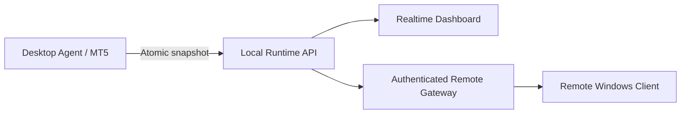
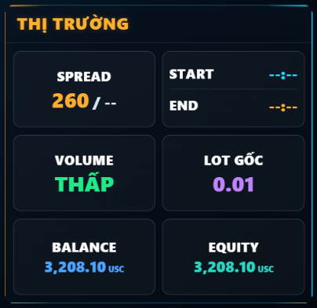

# Magic AI Gold V5 — Product & Engineering Showcase

<p align="center">
  
</p>

**Magic AI Gold V5.0.12** là một dự án dashboard giám sát thời gian thực cho
nhiều tiến trình MT5. Repository này là bản **portfolio công khai đã làm sạch**:
trình bày bài toán, kiến trúc, trải nghiệm người dùng, quy trình kiểm thử và một
module code mẫu; không phát hành chiến lược giao dịch hoặc sản phẩm thương mại.

> Public portfolio only. Proprietary EA, executable, production source code,
> license keys and customer data are intentionally excluded.

## Bài toán đã giải quyết

- Theo dõi đồng thời tối đa 10 nguồn dữ liệu độc lập.
- Hiển thị trạng thái kết nối, dữ liệu tài khoản và tình trạng vận hành gần thời gian thực.
- Phân biệt dữ liệu mới, dữ liệu chậm và nguồn đã ngừng cập nhật.
- Chuyển đổi Host/Remote mà không đóng giao diện đang sử dụng.
- Điều khiển từ laptop tới Runtime trên VPS qua kết nối xác thực và mã hóa.
- Đóng gói ứng dụng Windows, quản lý license theo thiết bị và kiểm thử hồi quy.
- Thiết kế nhiều tỷ lệ màn hình: 16:9, 9:16, 1:1 và 3:4.

## Kiến trúc tổng quan



Dashboard không lưu mật khẩu giao dịch. Dữ liệu demo trong repository hoàn toàn
giả lập và module Python chỉ minh họa lớp chuẩn hóa snapshot, không chứa tín hiệu
vào lệnh hoặc thuật toán giao dịch.

## Hình ảnh sản phẩm

### Thông tin thị trường và tài khoản



Giao diện ưu tiên khả năng đọc nhanh: Spread hiện tại/giới hạn, lịch Start/End,
lot khởi đầu, Balance và Equity. Các giá trị được lấy từ snapshot của Agent,
không suy đoán ở phía giao diện.

## Những quyết định kỹ thuật nổi bật

- Snapshot được ghi theo cơ chế atomic để tránh Dashboard đọc trúng JSON đang ghi dở.
- Change token và long-poll giúp phản hồi ngay khi dữ liệu đổi, giảm request rỗng.
- Connection epoch ngăn response từ backend cũ ghi đè dữ liệu sau khi đổi Host/Remote.
- License chỉ chuyển hệ thống sang chế độ hạn chế; không làm mất dữ liệu quan sát.
- Lệnh điều khiển có ID riêng và cần ACK từ Agent trước khi giao diện báo thành công.
- Dữ liệu Remote được xác thực; thông tin nhạy cảm trên Windows được bảo vệ theo người dùng.

## Vai trò trong dự án

**Product Owner / AI-assisted Product Builder / QA**

- Xác định bài toán người dùng và ưu tiên chức năng.
- Thiết kế luồng Dashboard, Host/Remote, license và trạng thái lỗi.
- Định nghĩa mapping giữa dữ liệu Agent và giao diện.
- Kiểm thử tình huống thực tế trên Windows/VPS và mô tả lỗi có thể tái hiện.
- Điều phối quy trình phát triển có AI hỗ trợ, kiểm tra kết quả và yêu cầu sửa đến khi đạt tiêu chí.
- Duy trì checklist phát hành và bộ kiểm thử hồi quy.

Repository không tuyên bố rằng toàn bộ mã nguồn được viết thủ công bởi một cá nhân.
Điểm trọng tâm là khả năng biến yêu cầu thực tế thành sản phẩm có thể kiểm tra và vận hành.

## Code mẫu an toàn

`src/magic_ai_showcase/snapshot_contract.py` là module độc lập minh họa:

- Kiểm tra cấu trúc dữ liệu đầu vào.
- Chuẩn hóa kiểu dữ liệu.
- Sinh change token ổn định.
- Phân loại `ONLINE / STALE / OFFLINE` theo heartbeat.

Chạy kiểm thử bằng Python 3.11 trở lên:

```bash
python -m unittest discover -s tests -v
```

## Tài liệu

- [Case study](docs/CASE_STUDY.md)
- [Tổng quan kỹ thuật](docs/TECHNICAL_OVERVIEW.md)
- [Phạm vi bản public](docs/PUBLIC_PORTFOLIO_SCOPE.md)

## Bảo vệ sở hữu trí tuệ

Không repository public nào chứa `.mq5`, `.ex5`, EXE thương mại, khóa ký license,
token Remote hoặc dữ liệu khách hàng. Xem [LICENSE](LICENSE) và [SECURITY.md](SECURITY.md).

---

**Product owner:** Thanh Lai Dinh  
**Release represented:** V5.0.12 · August 2026
